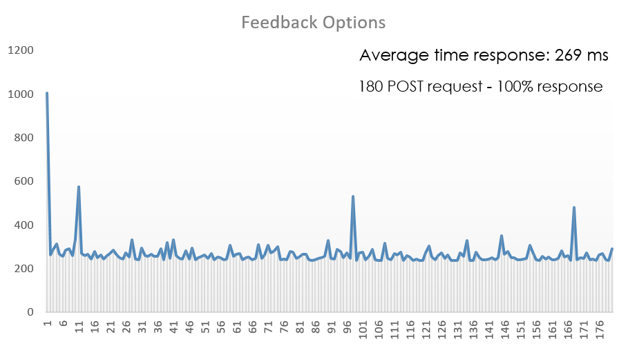
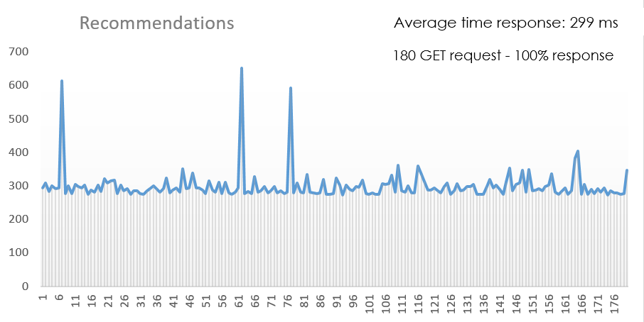

# MuleSoft - LOLA SQL server Stress test

[](https://www.getpostman.com/)  [](https://www.mulesoft.com/)

```
Here you can find all the information related about
Stress and load test developed by Everis-MuleSoft team 
to evaluate SQL server Database Performance.
```

`Note:` All endpoints must include `client_id` and `client_secret`

## What you can found here:

* `Test description:` step by step test description.
	 * Testing tool
	 * Input data
* `Sample data: ` All SQL information used to create the test scenario.
* `Collection - Postman: ` All the configurations used to stress and load test.
* `Postman result test:` The Postman stress and load test result. 
* `Evidences:` Screenshots from Postman.
* `Result analysis:` Information Analysis.
* `How to:` Import collections and environments in Postman.

### Test Description

#### Testing tool

* Postman is used as load testing tool.
* Jmeter is used as stress testing tool.

2 Endpoints are tested:

* FeedbackOptions (GET)
* Recommendations (GET)

* ##### FeedbackOptions

`https://abid-lola-sql-api.us-e1.cloudhub.io/api/feedbackOptions?`

`No input value required`

* ##### Recommendations

`https://abid-lola-sql-api.us-e1.cloudhub.io/api/recommendations?wslrCustPartyId=`

| KEY | VALUE |
| ------ | ------ |
| recomm_wslrNbr | 123 |
| recomm_wslrAsg | 123 |

### Sample data for V1.0

* `recommendations_MOCK_DATA.csv` file contains 180 JSON objects with all variable names and values to create dynamic request.

### Environment Postman
* `LOLA_SQL.postman_environment.json` file contains the environment configurations.

### Collection Postman
* `LOLA_SQL.postman_collection.json` file contains all endpoints configurations.

### Postman result test 

* `LOLA_SQL.postman_result` file contains all results of stress and load test from Postman.

### Evidences

* Here you can find the results as graphics images, also there are locates into `images` folder 

* The information used to create the graphics is located into: `Performance_test_SQL_Results.xlsx`.




### Result analysis

| Endpoint | Average Result |
| ------ | ------ |
| FeedbackOptions | 269 ms |
| Recommendations | 299 ms|

### How to

Related information about import collections and environment in Postman:

* [How to import a collection](https://developer.ft.com/portal/docs-start-install-postman-and-import-request-collection)

* [How to import an Environment](https://learning.getpostman.com/docs/postman/collection_runs/using_environments_in_collection_runs/)

The MIT License (MIT)
Copyright (c) 2019 Everis.
