# MuleSoft - LOLA SQL server Stress test

[](https://www.getpostman.com/)  [](https://www.mulesoft.com/)

```
Here you can find all the information related about
Stress and load test developed by Everis-MuleSoft team 
to evaluate SQL server Database Performance.
```

`Note:` All endpoints must include `client_id` and `client_secret`

## What you can found here:

* `Test description:` step by step test description.
	 * Testing tool
	 * Input data
* `Sample data: ` All SQL information used to create the test scenario.
* `Collection - Postman: ` All the configurations used to stress and load test.
* `Postman result test:` The Postman stress and load test result. 
* `Evidences:` Screenshots from Postman.
* `Result analysis:` Information Analysis.
* `How to:` Import collections and environments in Postman.

### Test Description

#### Testing tool

* Postman is used as load testing tool.
* Jmeter is used as stress testing tool.

13 Endpoints are tested:

* BrandPartitions (GET)
* FeedbackOptions (GET)
* OpportunitiesPerAccount (GET)
* Metrics (POST)
* Feedbacks (GET)
* Feedbacks (POST)
* RecommenationsPerAccount (GET)
* Recommendations (GET)
* RecommendationsSellingStories (GET)
* SKU (GET)
* SurveyMonthly (POST)
* SurveyValidator (GET)
* VSTSReport (POST)

#### Input data

* ##### BrandPartitions
`https://abid-lola-sql-api.us-e1.cloudhub.io/api/brandPartitions?`

`No input value required`

* ##### FeedbackOptions

`https://abid-lola-sql-api.us-e1.cloudhub.io/api/feedbackOptions?`

`No input value required`

* ##### OpportunitiesPerAccount

`https://abid-lola-sql-api.us-e1.cloudhub.io/api/opportunitiesPerAccount?`

| KEY | VALUE |
| ------ | ------ |
| wslr_Nbr_AsgndCust  | 10500,M1301;10500,100 |

* ##### Metrics

`https://abid-lola-sql-api.us-e1.cloudhub.io/api/metrics?`
```json
{
  "userId": "123",
  "applicationId": "1234",
  "applicationVersion": "1",
  "componentId": "123123",
  "recordId": "123444",
  "sessionID": "abc1234"
}
```

* ##### Feedbacks (GET)

`https://abid-lola-sql-api.us-e1.cloudhub.io/api/feedbacks?recoId=`

| KEY | VALUE |
| ------ | ------ |
| recoId | 123 |

* ##### Feedbacks (POST)

`https://abid-lola-sql-api.us-e1.cloudhub.io/api/feedbacks?`
```json
{
  "recomendationId": "987654321",
  "feedbackOptionId": "2000001",
  "activeFlag": "A",
  "createdByUserId": "jhondoe@mail.com",
  "modifiedByUserId": "jhondoe@mail.com",
  "EDW_MOD_FLG": "A"
}
```


* ##### RecommenationsPerAccount

`https://abid-lola-sql-api.us-e1.cloudhub.io/api/recommendationsPerAccount?wslr_Nbr_AsgndCust=`

| KEY | VALUE |
| ------ | ------ |
| wslr_Nbr_AsgndCust  | 10500,M1301;10500,100 |

* ##### Recommendations

`https://abid-lola-sql-api.us-e1.cloudhub.io/api/recommendations?wslrNbr=44276&wslrAsgndCustNbr=50866`

| KEY | VALUE |
| ------ | ------ |
| wslrNbr | 44276 |
| wslrAsgndCustNbr | 50866 |

* ##### RecommendationsSellingStories

`https://abid-lola-sql-api.us-e1.cloudhub.io/api/recommendationsSellingStories?wslrNbr=44276&wslrAsgndCustNbr=50866`

| KEY | VALUE |
| ------ | ------ |
| wslrNbr | 44276 |
| wslrAsgndCustNbr | 50866 |

* ##### SKU

`https://abid-lola-sql-api.us-e1.cloudhub.io/api/metrics?`

| KEY | VALUE |
| ------ | ------ |
| recoId | 123 |

* ##### SurveyMontly

`https://abid-lola-sql-api.us-e1.cloudhub.io/api/surveyMonthly?`
```json
{
  "userId": "123",
  "applicationId": "1234",
  "calendarYearMonthNumber": "1",
  "dayOfMonthNumber": "5",
  "ratingCode": "2",
  "sessionID": "abc123"
}
```

* ##### surveyValidator

`https://abid-lola-sql-api.us-e1.cloudhub.io/api/surveyValidator?userID=44276&validationDays=6`

| KEY | VALUE |
| ------ | ------ |
| userID | 123 |
| validationDays | 6 |


* ##### VSTSReport

`https://abid-lola-sql-api.us-e1.cloudhub.io/api/vstsReport?`
```json
{
  "userId": "123",
  "applicationId": "1234",
  "sessionID": "abc123",
  "title": "abc123",
  "userReason": "many reasons",
  "userMessage": "lorem ipsum"
}
```

### Sample data for V1.0

* `recommendations_MOCK_DATA.csv` file contains 180 JSON objects with all variable names and values to create dynamic request.

### Sample data for V1.1

* `recommendations_MOCK_DATA.csv` file contains 180 JSON objects with all variable names and values to create dynamic request.

### Sample data for V1.2

* No sample data needed, 180 calls was maded with same record.


### Environment Postman
* `LOLA_SQL.postman_environment.json` file contains the environment configurations.

### Collection Postman
* `LOLA_SQL.postman_collection.json` file contains all endpoints configurations.

### Postman result test 

* `LOLA_SQL.postman_result` file contains all results of stress and load test from Postman.

### Evidences

* Here you can find the results as graphics images, also there are locates into `images` folder 

* The information used to create the graphics is located into: `Performance_test_SQL_Results.xlsx`.

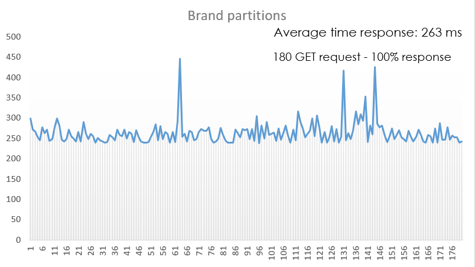

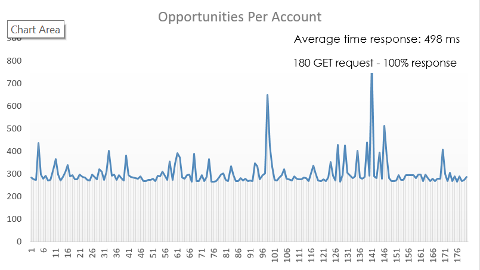
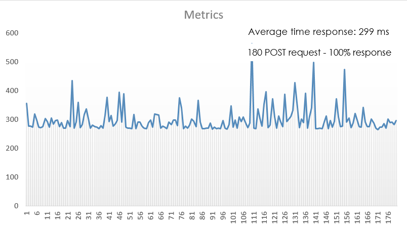
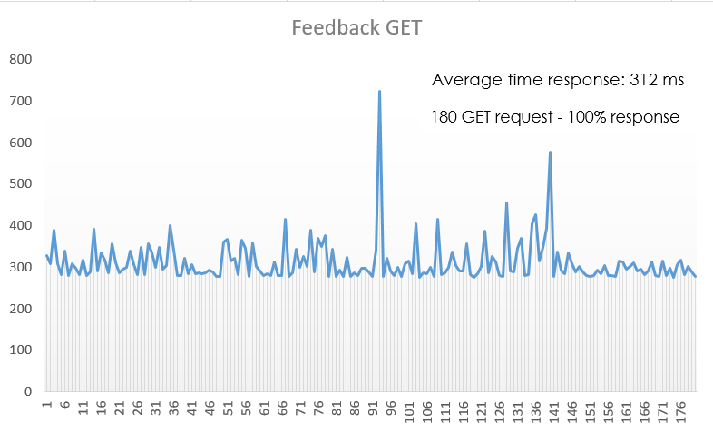
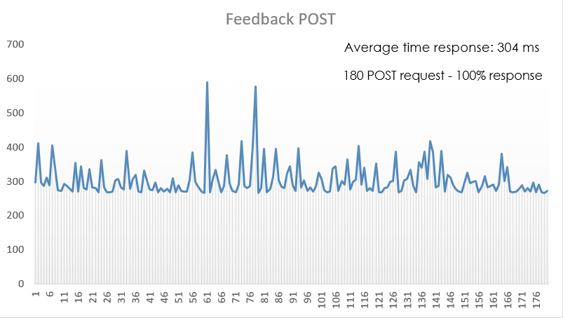
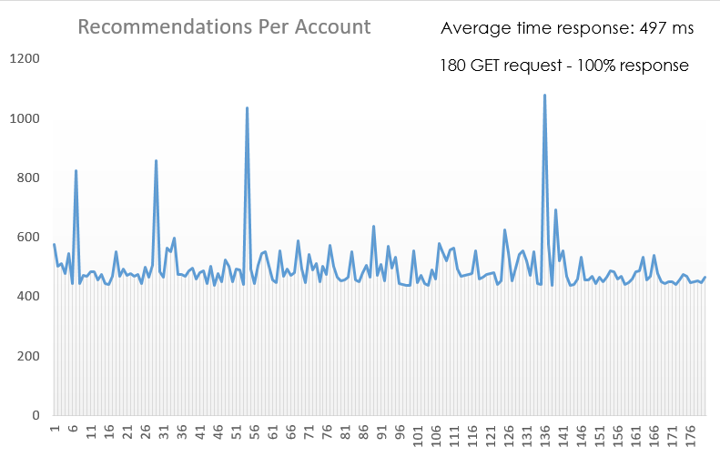
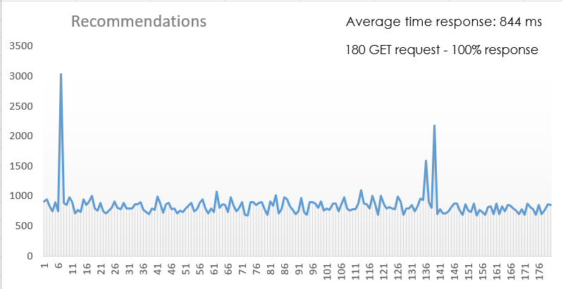
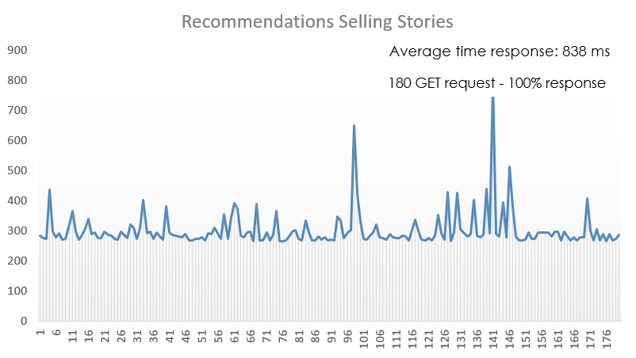
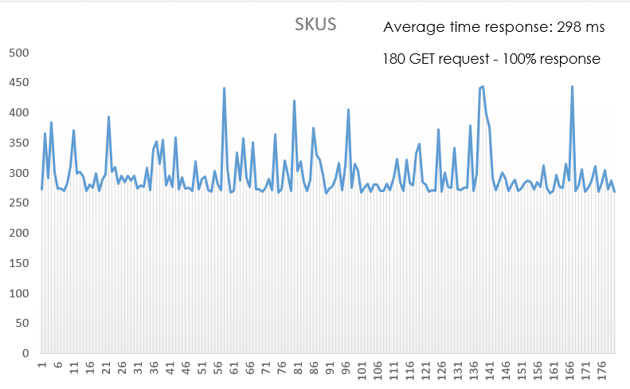
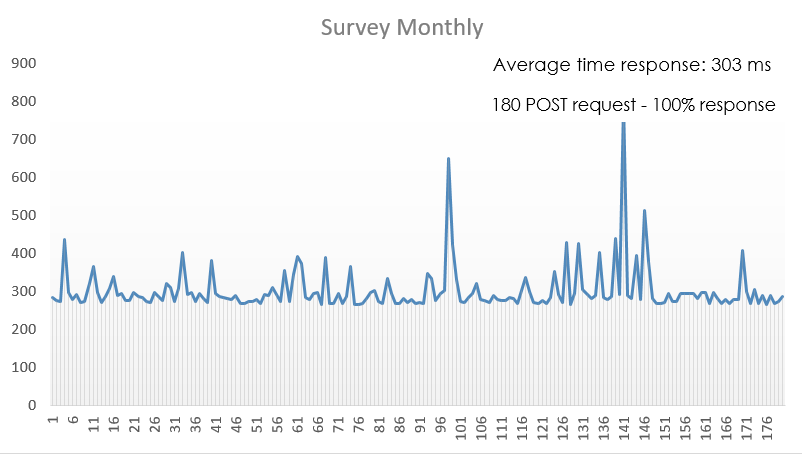
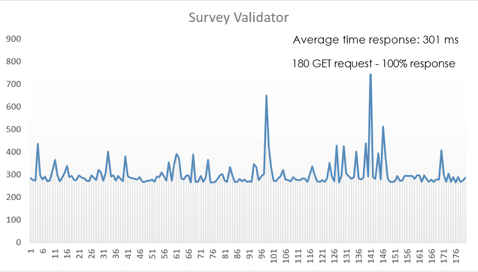

### Result analysis

| Endpoint | Average Result |
| ------ | ------ |
| brandPartitions | 263 ms |
| feedbackOptions | 271 ms |
| opportunitiesPerAccount | 498 ms |
| metrics | 299 ms |
| feedback (GET) | 312 ms |
| feedback (POST) | 304 ms |
| recommendationsPerAccount | 497 ms |
| recommendations | 844 ms |
| recommendationsSellingStories | 838 ms |
| skus | 298 ms |
| surveyMonthly | 303 ms |
| surveyValidator | 301 ms|

### How to

Related information about import collections and environment in Postman:

* [How to import a collection](https://developer.ft.com/portal/docs-start-install-postman-and-import-request-collection)

* [How to import an Environment](https://learning.getpostman.com/docs/postman/collection_runs/using_environments_in_collection_runs/)

The MIT License (MIT)
Copyright (c) 2019 Everis.
